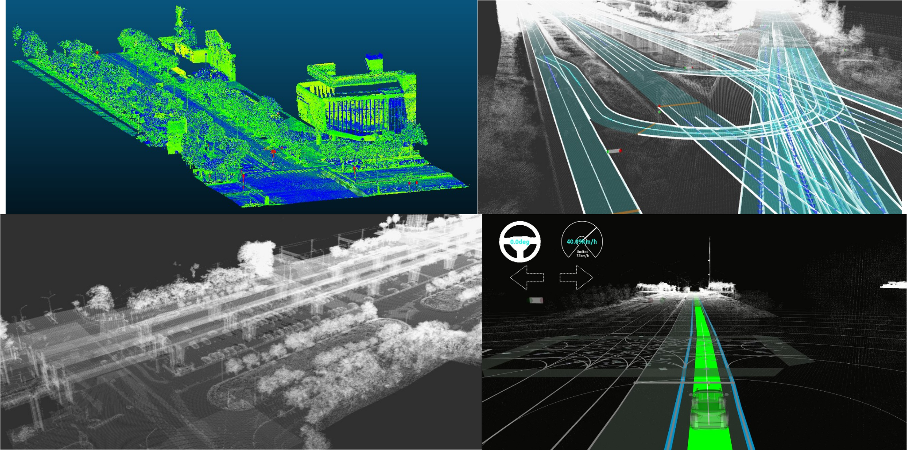

# HD map tools

## Overview

***HD_map_tools*** is a tool for processing point clouds and vector-based high-definition maps. Developed based on the PCL (Point Cloud Library) and LAStools libraries, this C++ tool is designed for HD map processing. It also supports processing vector-based HD maps (lanelet2) and is developed using tinyXML. Currently, it has been successfully used and tested on HD maps produced by several surveying companies. The development of this tool is ongoing.

> [!NOTE]  
> The recommended environment is Ubuntu 20.04 or above.

## Author

**Yen En Huang**, POINT Lab, Geomatics NCKU, Taiwan

## Fuctions

***point_cloud_tools*** consists of four fuctions. (Keep developing more)

* *las2pcd_all_in_one*
* *osm_movement*
* *pcd_downsample*
* *pcd_movement*
* *pcd_merge*

